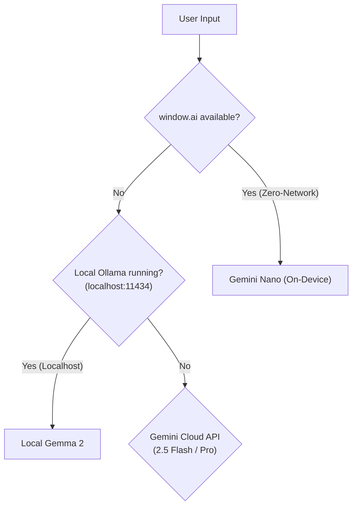

# Chrome Built-in AI & Local LLM Integration Skill

This skill outlines how InsightSpark achieves 100% offline, zero-network data privacy using Chrome's Prompt API (Gemini Nano) and Local Gemma via Ollama.

---

## 1. Multi-Engine Intelligence Hierarchy

InsightSpark uses a progressive fallback ladder:



---

## 2. Chrome Prompt API (`window.ai`) Integration

### A. Feature Detection & Capability Check
```typescript
async function checkChromeAiAvailability(): Promise<boolean> {
  if (typeof window === 'undefined') return false;
  const aiObj = (window as any).ai || (window as any).model;
  if (!aiObj?.languageModel) return false;
  
  try {
    const capabilities = await aiObj.languageModel.capabilities();
    return capabilities.available === 'readily';
  } catch {
    return false;
  }
}
```

### B. Session Lifecycle
Always clone or destroy sessions after completion to avoid memory leaks:
```typescript
const session = await (window as any).ai.languageModel.create({
  systemPrompt: "You are a positive psychology companion..."
});

try {
  const result = await session.prompt(userInput);
  return result;
} finally {
  session.destroy();
}
```

---

## 3. Local Gemma Bridge (Ollama)

When running on `localhost:11434`:
- Endpoint: `POST http://localhost:11434/api/generate`
- Default model: `gemma2:9b` or `gemma2:2b`
- System instructions are prepended to the prompt with `format: 'json'` enforced.
