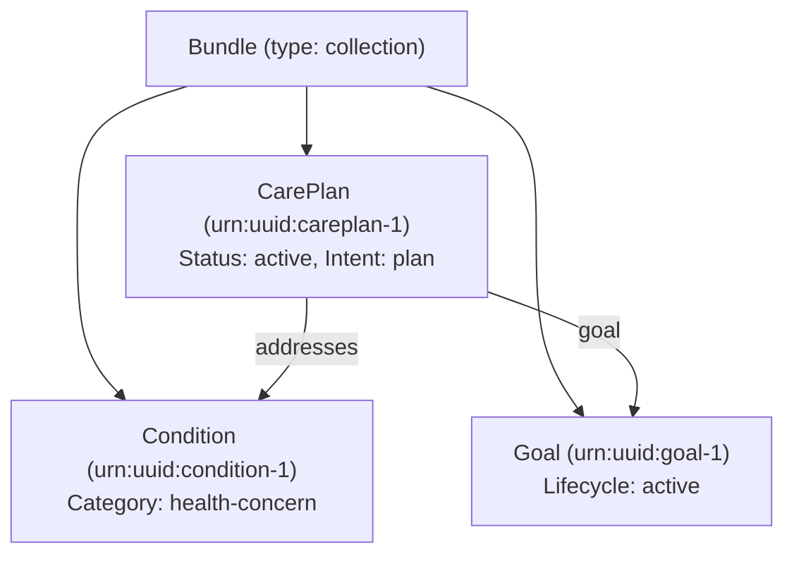

# HL7 FHIR R4 CarePlan Modeling Skill

This skill guides AI agents in authoring, validating, and bundling compliant HL7 FHIR R4 health care plans generated by InsightSpark.

---

## 1. FHIR Bundle Specification

An InsightSpark Care Plan Bundle is a `collection` containing three interdependent resources:



---

## 2. Resource Schemas

### A. Condition
```json
{
  "resourceType": "Condition",
  "id": "condition-1",
  "clinicalStatus": {
    "coding": [{ "system": "http://terminology.hl7.org/CodeSystem/condition-clinical", "code": "active", "display": "Active" }]
  },
  "verificationStatus": {
    "coding": [{ "system": "http://terminology.hl7.org/CodeSystem/condition-ver-status", "code": "confirmed", "display": "Confirmed" }]
  },
  "category": [{
    "coding": [{ "system": "http://terminology.hl7.org/CodeSystem/condition-category", "code": "health-concern", "display": "Health Concern" }]
  }],
  "code": { "text": "De-identified health condition summary" },
  "subject": { "display": "Anonymous Person (De-identified)" }
}
```

### B. Goal
```json
{
  "resourceType": "Goal",
  "id": "goal-1",
  "lifecycleStatus": "active",
  "description": { "text": "Empowering person-centric goal statement" },
  "subject": { "display": "Anonymous Person (De-identified)" }
}
```

### C. CarePlan & Activities
All actions, interventions, and transition checklists map to `activity` items:
```json
{
  "resourceType": "CarePlan",
  "id": "careplan-1",
  "status": "active",
  "intent": "plan",
  "title": "Person-Centered Care Plan",
  "subject": { "display": "Anonymous Person (De-identified)" },
  "addresses": [{ "reference": "urn:uuid:condition-1" }],
  "goal": [{ "reference": "urn:uuid:goal-1" }],
  "activity": [
    {
      "detail": {
        "kind": "ServiceRequest",
        "status": "not-started",
        "description": "Daily gentle walking or physical intervention",
        "doNotPerform": false
      }
    },
    {
      "detail": {
        "kind": "ServiceRequest",
        "status": "not-started",
        "description": "[Transition Protocol]: Complete 72-hour medication reconciliation",
        "doNotPerform": false
      }
    }
  ],
  "note": [
    { "text": "[Monitoring]: Monitor morning vitals and hydration" },
    { "text": "[Respite Safeguard]: Mandatory 4-hour weekend caregiver handoff" }
  ]
}
```

---

## 3. Privacy & Compliance Rules
1. Never emit real patient names, dates of birth, MRNs, or physical addresses (`subject.display` must remain de-identified).
2. All clinical notes must use asset-based, positive language avoiding stigma or blame.
