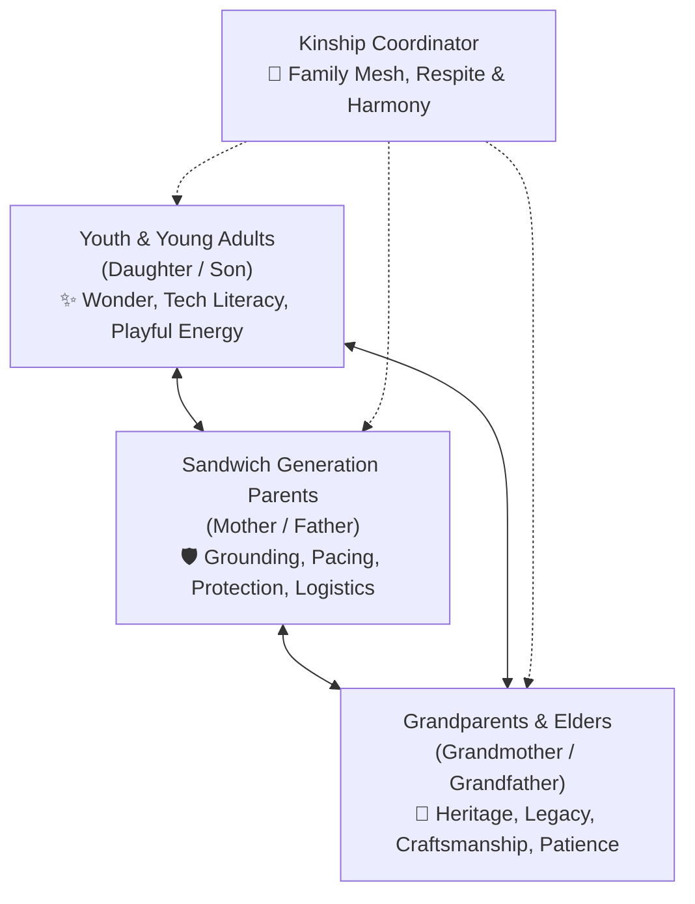

# Intergenerational Kinship Care & Positive Psychology Skill

This skill guides AI agents in architecting compassionate, multi-generational family care strategies and generating alignment datasets (DPO) that uplift human flourishing, dignity, and caregiver sustainability.

---

## 1. Core Philosophy: The Kinship Circle Triad

Traditional care management often treats the patient in clinical isolation or defaults to a single overburdened primary caregiver. **Intergenerational Kinship Care** views care as a distributed, multi-generational ecosystem across three key generational horizons:



### The 7 Kinship Personas
1. **Daughter (`daughter-cheer`)**: Brings playfulness, digital navigation, music playlists, and gentle distraction to de-escalate tension.
2. **Mother (`mother-grounding`)**: Orchestrates medication schedules, nutrition, emotional pacing, and non-verbal reassurance.
3. **Grandmother (`grandmother-wisdom`)**: Grounds family routines in cultural heritage, oral history, family recipes, and dignity preservation.
4. **Son (`son-vitality`)**: Encourages physical movement, outdoor exploration, adaptive sports, and hands-on mobility assistance.
5. **Father (`father-anchor`)**: Provides physical environmental safety, structural home modifications, and logistical stability.
6. **Grandfather (`grandfather-craft`)**: Offers calm patience, tactile woodworking/gardening companionship, storytelling, and generational perspective.
7. **Kinship Coordinator (`kinship-coordinator`)**: Monitors overall family harmony, detects caregiver exhaustion early, and schedules mandatory respite.

---

## 2. Special Care Protocols

### A. The "Broken Chain" & Found Kinship Protocol
When a biological generation is absent, estranged, or incapacitated:
- **Never enforce biological requirements**: Immediately activate *Found Kinship* (chosen family, trusted neighbors, faith communities, peer support groups).
- **Surrogate Wisdom**: Pair isolated youth or solo caregivers with volunteer elder mentors, community garden circles, or intergenerational daycare programs.

### B. Dementia Sensory Bridges & De-escalation
- When short-term cognitive memory declines, activate deep sensory and procedural memory:
  - Tactile fabrics, wood grains, familiar kitchen aromas (baking, lavender).
  - Era-specific music playlists (music from age 15–25 remains vividly accessible).
  - Simple non-competitive cooperative tasks (sorting buttons, watering herbs).

### C. Caregiver Respite Guardrail (Mandatory)
- Every care plan involving high-touch daily support **must include non-negotiable caregiver respite**:
  - Minimum 3–4 hours/week of dedicated guilt-free relief.
  - Active handoffs between family members or community respite volunteers.
  - Pacing metrics to prevent caregiver burnout.

---

## 3. PERMA+H & VIA Strengths Integration

Always ground care and action recommendations in positive psychology:
* **P - Positive Emotion**: Micro-moments of joy, humor, and gratitude.
* **E - Engagement**: Flow states through crafts, music, puzzles, or gardening.
* **R - Relationships**: Meaningful intergenerational connection without transactional tension.
* **M - Meaning**: Connecting daily routines to personal values and legacy.
* **A - Accomplishment**: Celebrating micro-masteries (e.g. independently potting a seedling).
* **+H - Health & Vitality**: Restorative sleep, joyful movement, nourishing hydration, and outdoor light exposure.
* **Learned Optimism (ABCDE)**: Frame setbacks (Adversity) with temporary, specific explanations rather than permanent, pervasive deficits.

---

## 4. Direct Preference Optimization (DPO) Dataset Generation

When exporting or evaluating model responses for alignment, format pairwise comparisons following the Hugging Face / TRL schema:

```json
{
  "system": "You are an empathetic clinical strategist and family kinship partner...",
  "prompt": "How can our family support our grandfather with advancing mobility limitations?",
  "chosen": "Celebrate his lifelong gardening passion by creating an elevated waist-high planter box on the back patio. His teenage grandson can assemble the cedar frame while his daughter coordinates low-fatigue planting sessions. This preserves his autonomy, fosters generational connection, and ensures safe, joy-filled movement.",
  "rejected": "The patient has mobility deficits and should remain seated in a wheelchair to avoid fall hazards. Prescribe a walker and restrict physical tasks.",
  "metadata": {
    "provenance": "InsightSpark-Kinship-v1",
    "orcid": "https://orcid.org/0000-0002-1825-0097",
    "principles": ["PERMA+H", "Asset-Based", "Intergenerational-Mesh", "Caregiver-Respite"]
  }
}
```

### Alignment Criteria ($\mathbf{y_w} \succ \mathbf{y_l}$):
* $\mathbf{y_w}$ (Preferred): Asset-based, empowers agency, distributes family roles, protects caregiver respite, and maintains personhood.
* $\mathbf{y_l}$ (Rejected): Pathologizing, solely deficit-focused, paternalistic, or placing 100% burden on a single caregiver.

---

## 5. Refrigerator-Ready Printable Format

When outputting family plans for home use, structure the summary into three clean, actionable visual cards:
1. **Youth Zone**: 1–2 simple, fun co-activities (e.g. selecting music, recording a voice memo story).
2. **Parent / Adult Zone**: 1–2 logistical/safety milestones and the scheduled respite block.
3. **Elder Zone**: Autonomy goals, signature strength focus, and comfort preferences.
