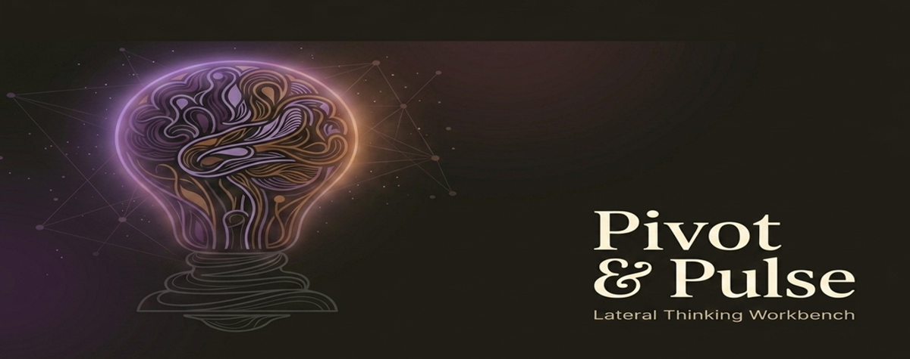
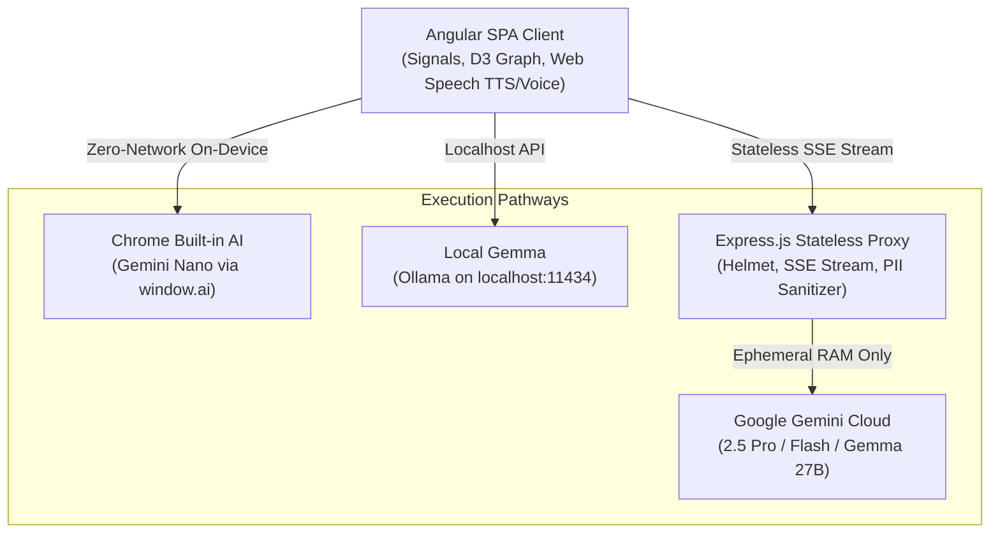
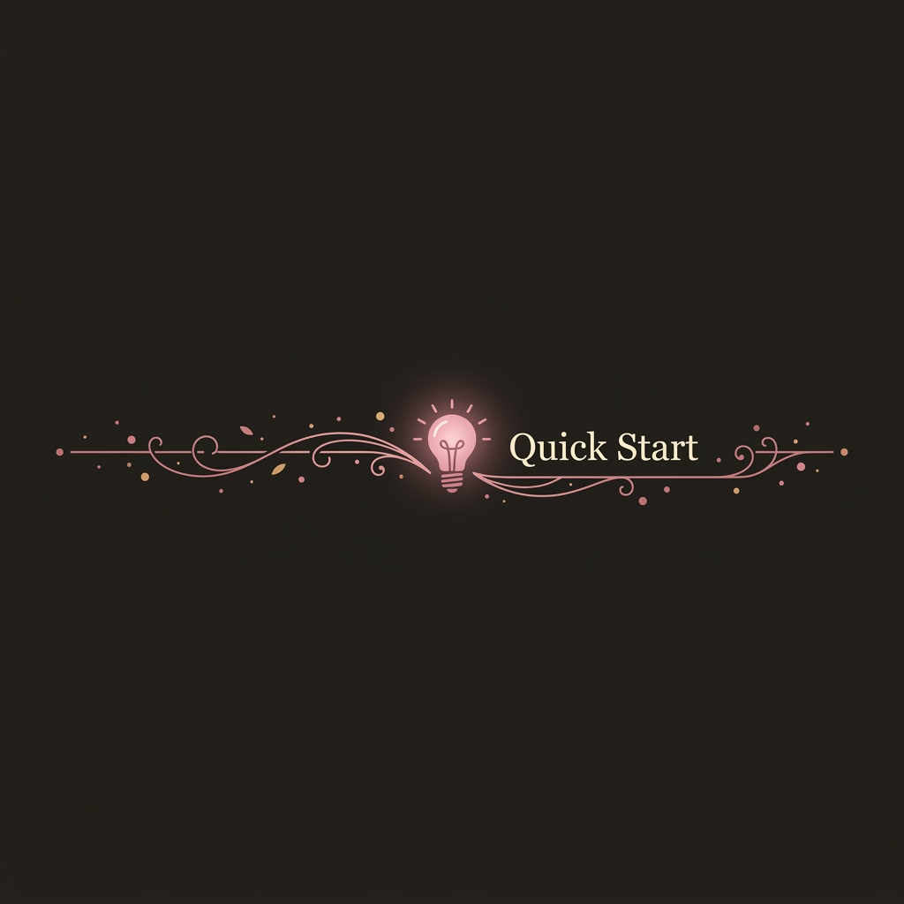
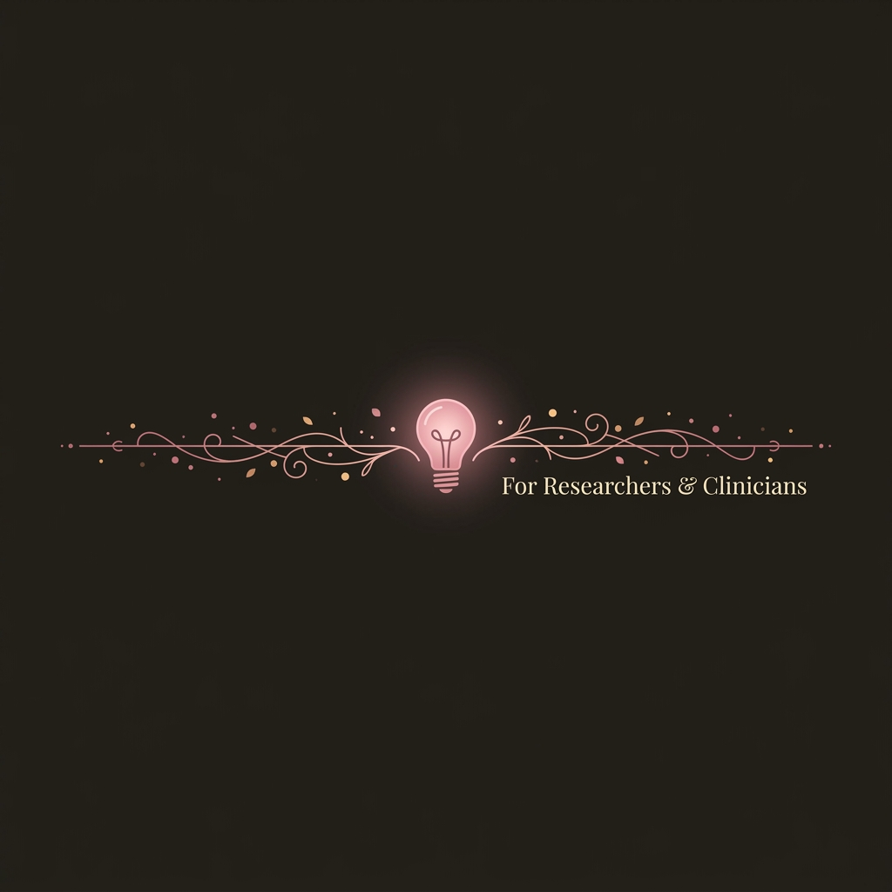

<div align="center">
  
</div>

<div align="center">

# Pivot & Pulse (InsightSpark)

[](https://github.com/philgear/InsightSpark/actions/workflows/ci.yml)
[](https://github.com/philgear/InsightSpark/actions/workflows/codeql.yml)
[](https://opensource.org/licenses/Apache-2.0)
[](https://orcid.org/0009-0008-1372-5381)
[](https://angular.dev/)
[](https://expressjs.com/)
[](tests/)
[](https://d3js.org/)
[](https://deepmind.google/technologies/gemini/)
[](https://ai.google.dev/gemma)
[](https://hl7.org/fhir/R4/)
[](datasets/kinship-care-dpo.parquet)
[](https://huggingface.co/docs/trl)

An interactive lateral thinking workbench, positive psychology companion, and intergenerational care planner. **Pivot & Pulse** synthesizes [Edward de Bono's](https://en.wikipedia.org/wiki/Edward_de_Bono) lateral thinking provocations with [Dr. Martin Seligman's](https://en.wikipedia.org/wiki/Martin_Seligman) PERMA+H framework (as taught in the UPenn [Foundations of Positive Psychology Specialization on Coursera](https://www.coursera.org/specializations/positivepsychology)), multi-generational family kinship dynamics, on-device Gemini Nano/Gemma intelligence, and HIPAA/COPPA-compliant clinical workflows.

[View App in Google AI Studio](https://ai.studio/apps/3eeb2b40-7093-4e40-b5a5-e1d2fbb75de7)

</div>

<div align="center">
  
</div>

### 1. Dual-Mode Thinking Workspaces
*   **🎨 Creative Mode:** Break through writer's block, deconstruct systemic bottlenecks, or prototype municipal/product architectures using lateral thinking techniques.
*   **🏥 Care Mode:** Design asset-based, person-centered health strategies anchored in positive psychology (PERMA+H), character strengths, and caregiver respite.

### 2. Multi-Engine Intelligence: Cloud, Local & On-Device
*   **⚡ Chrome Built-in AI (Gemini Nano):** Runs 100% locally on the user's device via `window.ai` Prompt API with **zero network requests and zero API keys**.
*   **🦙 Local Gemma (Ollama):** Seamless local LLM execution via `localhost:11434` for complete offline data privacy.
*   **☁️ Google Gemini Cloud:** Advanced reasoning powered by Gemini 2.5 Pro, Flash, and Gemma 2 27B.
*   **🚀 Interactive Demo Mode:** Immediate offline preview with simulated streaming insights.

### 3. Two-Tier Ideation: Provocations & Grounding Counterbalances
To prevent ungrounded or frictionless brainstorming, 24 strategies are organized into two distinct shelves ([CHANGELOG.md](CHANGELOG.md)):
*   **🌟 Divergent Provocations (17 Models):**
    *   *What If, Redefine Constraints, Butterfly Effect, Combinatorial Evolution, Opposite Day, Future Vision, Child's Play, Alien Perspective, Nature's Wisdom, Superpower, Eliminate & Simplify, Random Object, First Principles, Root Cause (5 Whys).*
    *   ✨ **Sensory Bridge & Somatics / Sensory Bridging & De-escalation:** Tactile, auditory, olfactory, and kinetic grounding to reduce anxiety.
    *   🤝 **Unlikely Alliances & Outsiders / Chosen Family & Community Circles:** Expanding kinship to chosen family, trusted neighbors, and peers.
    *   ⏳ **Time Dilation & Century Lens / Circadian Micro-Pacing:** Timescale reframing and biological energy pacing.
*   **⚖️ Grounding Counterbalances & Kinship Anchors (7 Models):**
    *   🛡️ **FMEA (Risk Analysis) / Safety Net:** Failure mode pre-mortems, consequence ranking, and mitigation guardrails.
    *   🌿 **Critical Path Method / Milestone Map:** Non-negotiable sequence dependencies and milestone timelines.
    *   ✨ **VIA Strengths & Optimism / PERMA+H:** Positive psychology signature strength amplification and Learned Optimism reframing.
    *   🌹 **Intergenerational Kinship / Family Kinship & Legacy:** Multi-generational family circles (Kids, Parents, Grandparents) and shared activities.
    *   🛡️ **Sustainable Sprint & Burnout Shield / Respite Safeguards & Caregiver Pacing:** Non-negotiable weekly respite protection and sustainable pacing.
    *   ⚖️ **Integrity & Non-Negotiables / Dignity, Autonomy & Values Alignment:** Living wills, advance directives, and ethical boundaries (*"Nothing about me without me"*).
    *   🏡 **Physical Grounding & Ergonomics / Living Room Safety & Hazard Pre-Mortem:** Fall hazards, throw rugs, grab bars, and room accessibility.

### 4. 🌹 Intergenerational Kinship & Living Room Collaboration
*   **7 Kinship Personas:** *Daughter (joy/tech), Mother (grounding/pacing), Grandmother (heritage/dignity), Son (action/vitality), Father (protection/safety), Grandfather (craftsmanship/patience), and Kinship Coordinator (harmony).*
*   **📋 Care Transition & Respite Closure Checklists:** Structured 72h acute discharge and 30d follow-up checklists mapped to HL7 FHIR R4 `ServiceRequest` bundles.
*   **🎙️ Living Room Voice Input & TTS Narration:** Native Web Speech API voice dictation for couch discussions and gentle Text-to-Speech audio read-aloud for kids and grandparents.
*   **🖨️ "Family Kinship Circle" Refrigerator Plan:** Formats a clean, printable single-page dashboard with dedicated pen-and-paper checkboxes (`[ ]`) for Youth, Parents, and Grandparents.

### 5. 🔮 Combinatorial Synergy Studio & Visual D3 Collision Bridges
*   **Curated Cross-Pollination Presets:** Instant activation of proven high-resonance strategy collisions:
    *   🌿 *Biomimetic Play:* Nature's evolutionary wisdom + child-like unconstrained curiosity.
    *   📐 *The Irreducible Lever:* First-principles deconstruction + radical elimination/simplification.
    *   🔄 *Stress-Tested Inversion:* 180° opposite-day inversion + rigorous FMEA pre-mortem safety nets.
    *   👵👧 *Kinship Harmony Mesh:* Multi-generational family legacy + protected non-negotiable caregiver respite.
*   **⚡ Smart Synergy Roller:** Algorithmic selector that pairs a high-friction divergent provocation with an anchoring grounding counterbalance to discover unexpected systemic solutions.
*   **Interactive Force-Directed Synergy Geometry:** When multiple strategies are combined, the D3 visualization dynamically generates a central `🔮 Synergy Collision` synthesis hub and animated dashed harmonic bridge links (`.synergy-bridge`) connecting active thought hubs.
*   **Live Divergence & PERMA+H Telemetry Badges:** Every generated insight card displays semantic distance badges (e.g. `⚡ 85%+ Orthogonal Leap`, `🌱 Adjacent Possible`, `👧👵 Kinship Mesh`, `🛡️ Protected Respite`).

### 6. 🤖 Multi-Agent Dialectic Debate & Synthesis Closure
*   5-phase dialectic debate engine running between opposing strategy agents.
*   Enforces structured `synthesisActionBridge` outputs: *Divergent Leap*, *Grounding Guardrail*, and *Immediate Traction Step* (24h action).

### 7. 📊 Direct Preference Optimization (DPO) Dataset Pipeline (JSONL & Parquet)
*   Export saved insights and care plans into standard Hugging Face/TRL `.jsonl` preference pairs ($\mathbf{y_w}$ Preferred vs $\mathbf{y_l}$ Penalized).
*   **Binary Apache Parquet Export:** Stream compressed, high-performance `.parquet` datasets directly from the Spark Deck UI or backend (`GET /api/export/parquet`), pre-indexed with embedded clinical metadata, PERMA+H schemas, and Apache-2.0 licensing.
*   Enforces asset-based, hopeful, and empowering language over pathologizing or deficit-based narratives.
*   Includes ORCID researcher attribution in the metadata header for academic provenance ([Phil Gear `0009-0008-1372-5381`](https://orcid.org/0009-0008-1372-5381)).

### 8. 🌐 Multilingual & Sister Cities Intelligence
*   Native real-time translation across **19 target locales**, including all **9 Portland Sister Cities** (Sapporo 🌸, Guadalajara 🇲🇽, Kaohsiung & Suzhou 🏮, Ulsan 🇰🇷, Bologna 🏛️, Ashkelon 🕊️, Kota Kinabalu 🌴, Mutare 🇿🇼, Arkhangelsk ❄️) with localized cultural nuances.
*   **Living Room Audio & Speech:** Real-time speech-to-text dictation and synthesized Web Speech TTS playback tuned to the selected target language.

---

<div align="center">
  
</div>



*   **Frontend ([src](./src)):** Built on Angular with signals for reactive state, D3.js for force-directed conceptual graphs, Web Speech API for voice/audio, and Tailwind CSS for glassmorphic design.
*   **Backend ([server.js](./server.js)):** A lightweight Express middleware proxy managing input sanitization, security headers (Helmet), Ollama bridges, and streaming Gemini SSE feeds with zero disk retention.

---

<div align="center">
  
</div>

### Prerequisites
Make sure you have [Node.js](https://nodejs.org/) (v18+) installed.

### 1. Clone & Install Dependencies
```bash
npm install
```

### 2. Set Up Environment Variables (Optional for Cloud)
Create a `.env.local` file in the root directory:
```env
GEMINI_API_KEY=your_gemini_api_key_here
```
*(Note: If using Chrome Built-in AI or Local Ollama, no cloud API key is needed!)*

### 3. Run Locally
To spin up both backend proxy and frontend:

*   **Start Backend API Proxy:**
    ```bash
    npm start
    ```
*   **Start Angular Client:**
    ```bash
    npm run dev
    ```

### 4. Run Test Suite & Build Verification
To execute the automated security, resilience, and clinical validation test suite:
```bash
npm test        # Runs all 50 automated tests across 15 unit, chaos engineering, fuzzing, FHIR R4, and DPO suites
npm run lint    # Verifies TypeScript & Angular code quality with zero errors/warnings
npm run build   # Verifies the production Angular bundle build
```

---

<div align="center">
  
</div>

### 1. IRB, HIPAA & COPPA Compliance Checklist
If you are submitting an Institutional Review Board (IRB) proposal or deploying in a care setting:
*   **Zero-Data Retention Backend:** The server proxy in [server.js](./server.js) is 100% stateless. No databases, logs of user prompts, or health queries are stored on disk.
*   **Client-Side Privacy Enforcement:** A PII scanner operates strictly inside the browser before any network dispatch, guarding against inadvertent PHI exposure.
*   **COPPA Kinship Mesh:** Language models are instructed with family-safe, non-pathologizing tone, with zero minor tracking.
*   **Local Sovereignty:** All saved items reside exclusively in the participant's local browser `localStorage`.

### 2. Provenance & ORCID Integration
To ensure academic provenance, this application integrates with the ORCID public OAuth 2.0 API. Connecting your researcher record signs exported care plans, action plans, and DPO `.jsonl` preference datasets with your verified ORCID iD ([Phil Gear `0009-0008-1372-5381`](https://orcid.org/0009-0008-1372-5381)).

### 3. How to Cite
If you use Pivot & Pulse (InsightSpark), its clinical care methodologies, or the DPO pairwise preference datasets in your research, please cite it using the following APA or BibTeX format:

**APA 7th Edition:**
> Gear, P. (2026). *Pivot & Pulse (InsightSpark): A Lateral Thinking Workbench, Intergenerational Care Planner, and Healthcare AI Alignment Dataset* (Version 2.1.1) [Computer software]. Apache-2.0. https://github.com/philgear/InsightSpark

**BibTeX:**
```bibtex
@software{gear2026pivotpulse,
  author       = {Gear, Phil},
  title        = {{Pivot \& Pulse (InsightSpark): A Lateral Thinking Workbench, Intergenerational Care Planner, and Healthcare AI Alignment Dataset}},
  year         = {2026},
  month        = {9},
  version      = {2.1.1},
  license      = {Apache-2.0},
  url          = {https://github.com/philgear/InsightSpark},
  orcid        = {https://orcid.org/0009-0008-1372-5381}
}
```
*(A standard `CITATION.cff` file is included in the repository root for automated BibTeX and APA export via GitHub's "Cite this repository" feature).*

---

<div align="center">
  
</div>

- Core system designed by **Phil Gear**.
- AI services powered by **Google Gemini** & **Google Gemma**.
- Lateral Thinking methodologies inspired by **[Edward de Bono](https://en.wikipedia.org/wiki/Edward_de_Bono)** (resources available at [debono.com](https://www.debono.com)).
- Positive Psychology & PERMA+H framework inspired by **[Dr. Martin E.P. Seligman](https://en.wikipedia.org/wiki/Martin_Seligman)** and the UPenn Positive Psychology Center — explore Dr. Seligman's official Coursera specialization: **[Foundations of Positive Psychology Specialization by Dr. Martin Seligman on Coursera](https://www.coursera.org/specializations/positivepsychology)** (and Course 1: *[Positive Psychology: Martin E. P. Seligman’s Visionary Science](https://www.coursera.org/learn/positive-psychology-visionary-science)*).

---

<div align="center">

*"I often go into thrift stores to read their books.*
*I discovered this one on the shelf, bought it, and flipped through it.*
*Still have it.. still haven't read it fully."*

— **Phil Gear**, on finding Edward de Bono's book and the spark that became this project.

💡

</div>
